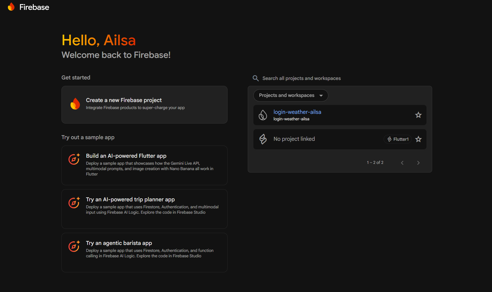
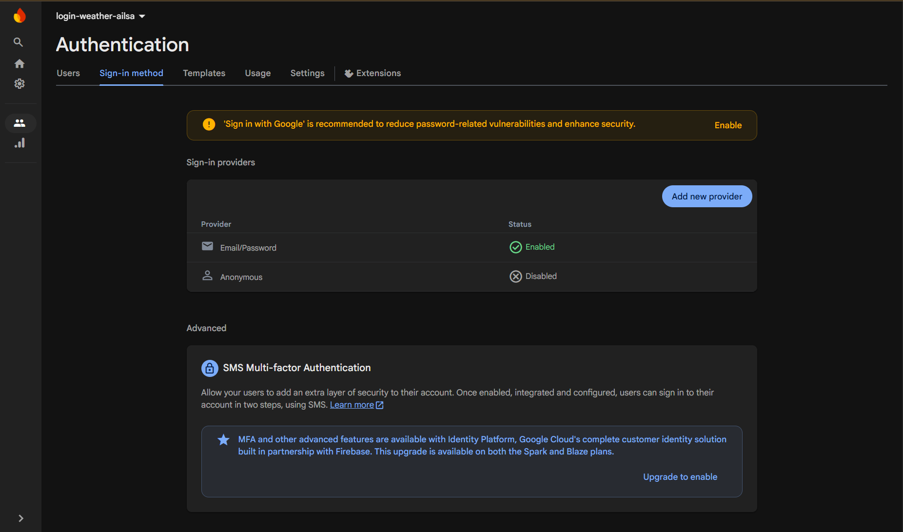
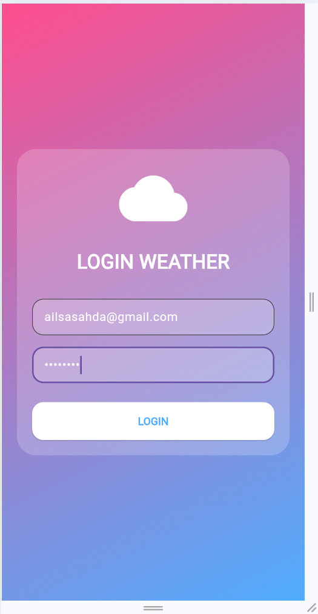
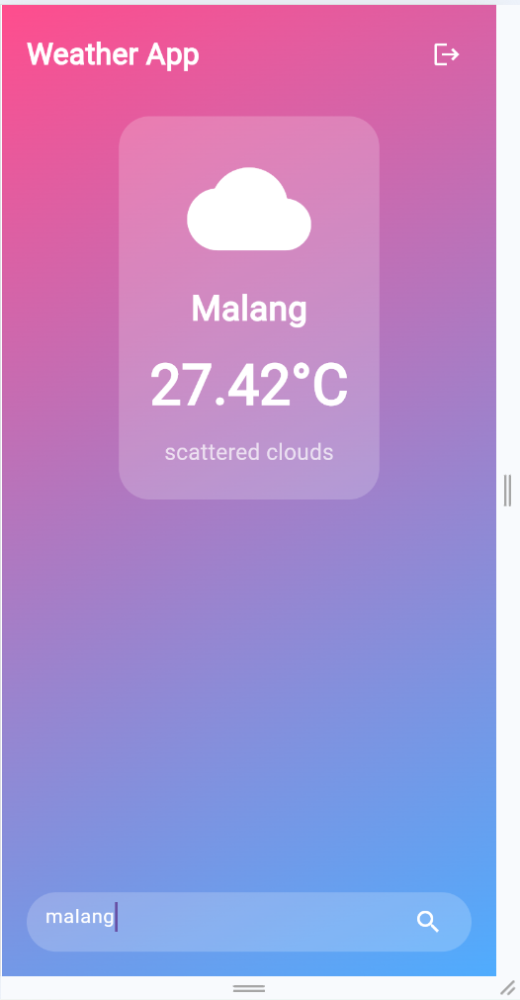
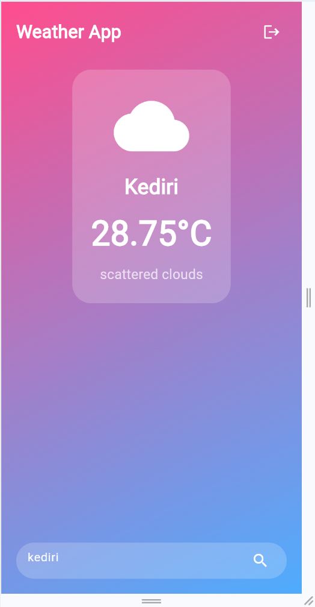

# FIREBASE API WEATHER

Name: Ailsa Sahda GArizah
Class: SIB 2G
NIM: 244107060006

Laporan Praktikum Flutter – Minggu 12 
Integrasi Firebase Authentication dan OpenWeather API 

Dokumen ini merupakan laporan praktikum yang menjelaskan proses integrasi Firebase Authentication dan OpenWeather API ke dalam aplikasi Flutter. Laporan ini mencakup proses konfigurasi, implementasi, hingga hasil akhir dari aplikasi yang telah dibuat. 

Proses Setup
1. Konfigurasi Firebase 
Pada tahap awal, dilakukan konfigurasi backend menggunakan Firebase dengan langkah-langkah berikut: 
    - Membuat project baru di Firebase Console dengan nama “login-weather-ailsa” 
    - Mengaktifkan fitur Authentication dengan metode Email/Password 
    - Menambahkan akun pengguna uji coba secara manual pada menu Users 
Firebase digunakan sebagai sistem autentikasi untuk mengelola proses login pengguna secara aman. 

2. Integrasi Flutter dengan Firebase (FlutterFire CLI)
Selanjutnya dilakukan integrasi project Flutter dengan Firebase menggunakan FlutterFire CLI dengan langkah berikut:
    - Login ke Firebase CLI untuk menghubungkan akun Google 
    - Menghubungkan project Flutter dengan Firebase project yang telah dibuat 
    - Menghasilkan file konfigurasi otomatis bernama firebase_options.dart 
    - Menginisialisasi Firebase di dalam file main.dart menggunakan Firebase.initializeApp() 
Proses ini memastikan aplikasi Flutter dapat terhubung dengan layanan Firebase. 

-----------------------------------------------------
Hasil Analysis 
1. Pembuatan Firebase Project (Project Name)
    -> Langkah pertama dalam integrasi Firebase adalah membuat project baru pada Firebase Console. Project ini berfungsi sebagai wadah utama untuk semua layanan Firebase yang akan digunakan, seperti Authentication dan database.
    

2. Mengaktifkan Email/Password pada Firebase Authentication 
   -> Langkah selanjutnya integrasi Firebase Authentication, langkah pertama yang dilakukan adalah mengaktifkan metode login Email/Password di Firebase Console. 
   

3. Pembuatan Email dan Password untuk Login (Firebase Authentication) 
    -> Setelah Aktivasi email/password berhasil dibuat dan fitur Authentication diaktifkan, langkah berikutnya adalah membuat akun pengguna yang akan digunakan untuk login ke aplikasi. 

4. Halaman Login 
    -> Halaman login bertujuan untuk: 
    - Memverifikasi identitas pengguna 
    - Membatasi akses agar hanya user terdaftar yang bisa masuk aplikasi 
    - Menghubungkan aplikasi Flutter dengan Firebase Authentication 
    

5. Halaman Weather 
    -> Halaman Weather merupakan halaman utama setelah pengguna berhasil login melalui Firebase Authentication. Halaman ini berfungsi untuk menampilkan informasi cuaca secara real-time berdasarkan kota yang dicari oleh pengguna menggunakan OpenWeather API. 
    Implementasi: 
    - Malang 
    
    - Kediri 
    

kesimpulan 
Secara keseluruhan, praktikum ini berhasil menunjukkan bahwa Flutter dapat digunakan untuk membangun aplikasi mobile yang dinamis, terhubung dengan layanan backend (Firebase), serta terintegrasi dengan API eksternal secara efektif.
