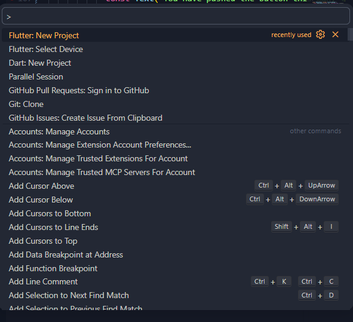
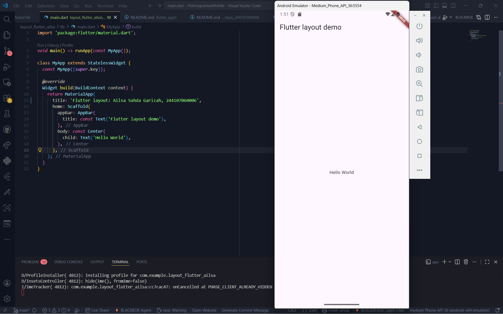
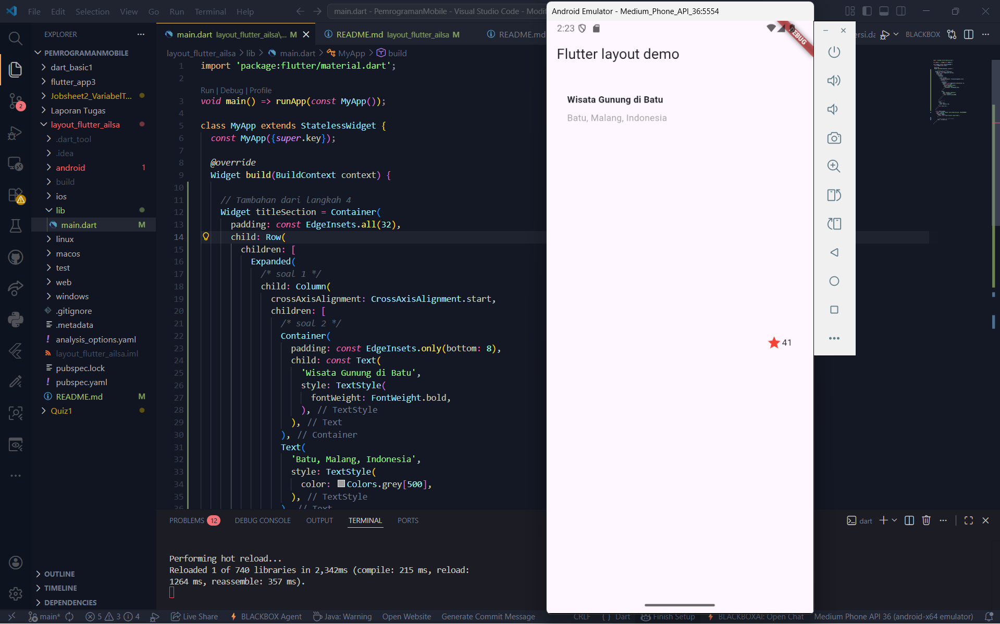
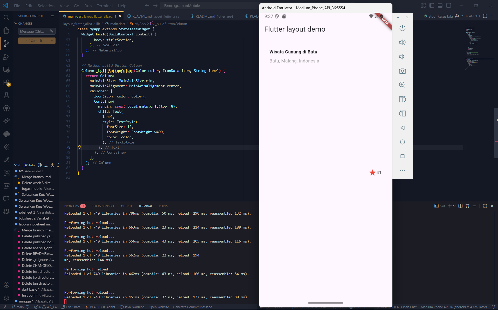
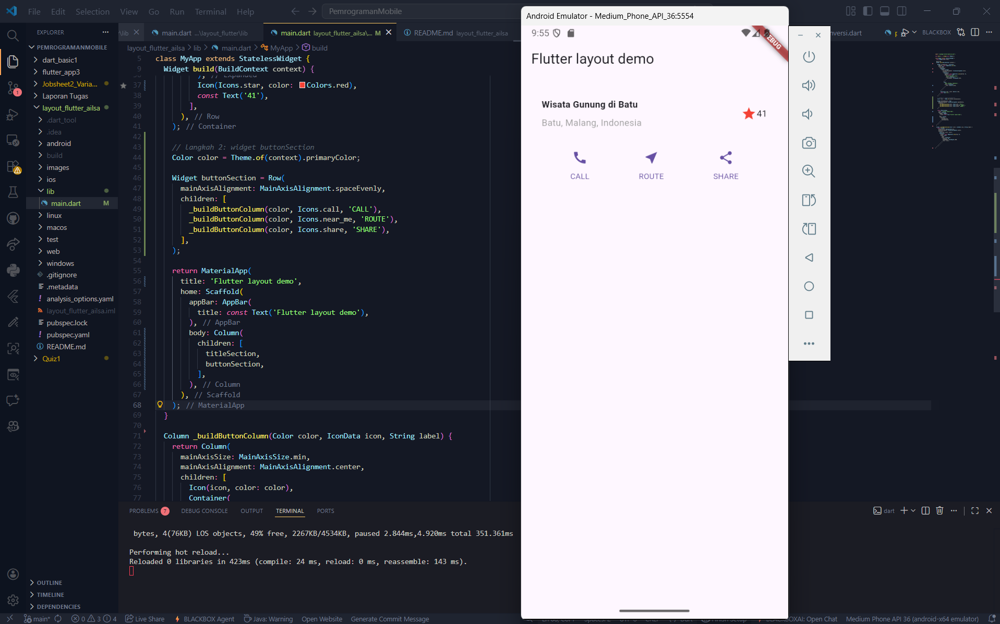
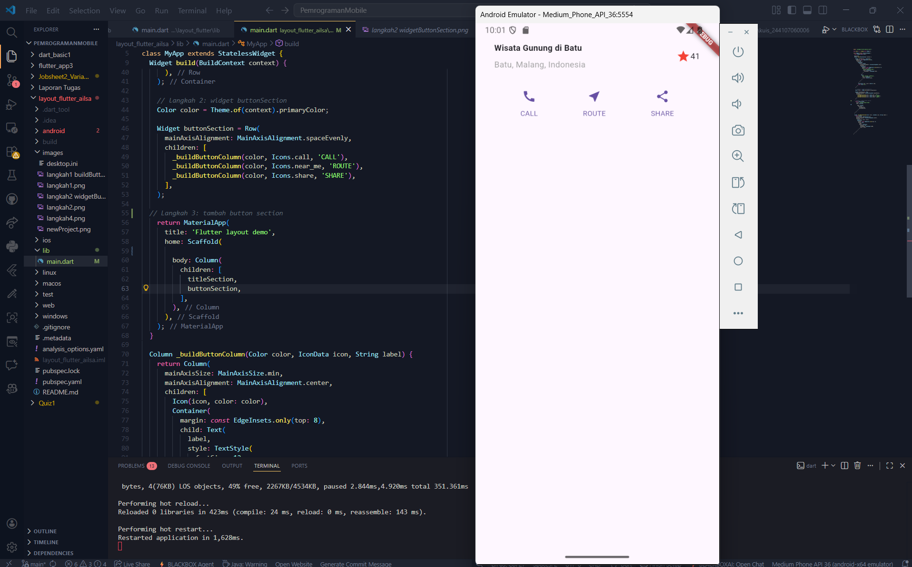
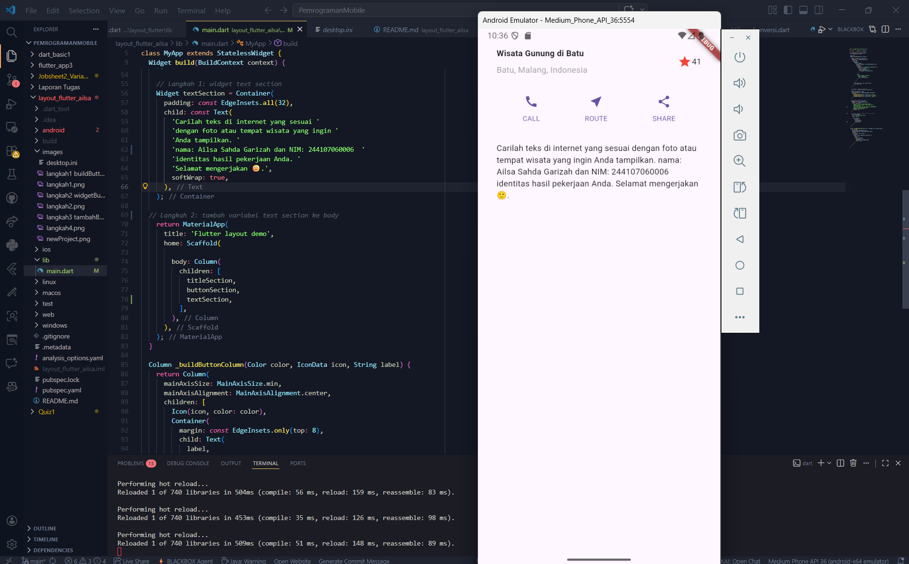
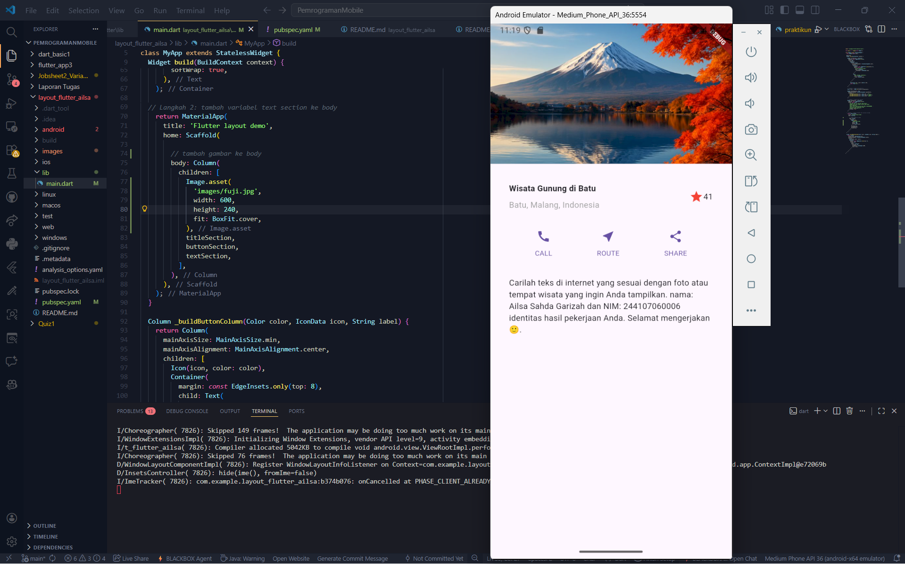
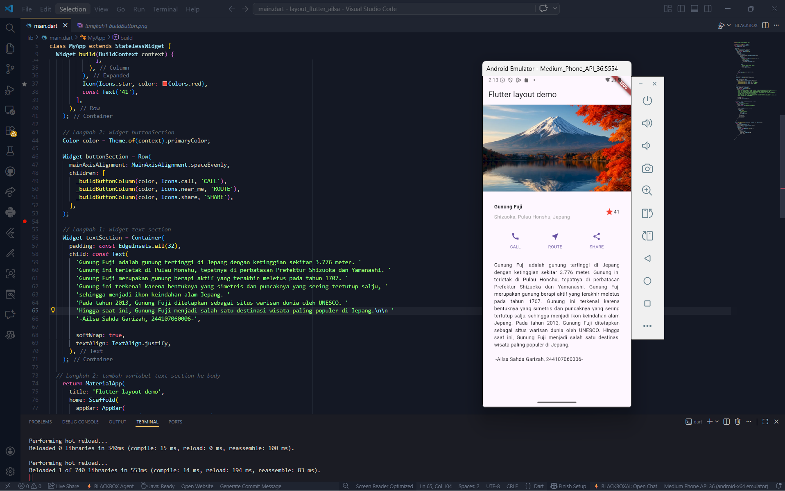

# layout_flutter_ailsa
-- Ailsa Sahda Garizah
-------------------------------------------------------------

1. Proses membuat new project dengan menggunakan flutter untuk memulai membuat project layout flutter

2. Langkah ini bertujuan untuk membuat project Flutter baru sebagai dasar pengembangan aplikasi. Dengan membuat project baru, struktur folder dan konfigurasi awal aplikasi dapat dibuat secara otomatis sehingga memudahkan dalam pengembangan serta menjaga kerapian kode sesuai dengan kebutuhan praktikum.

3. Langkah ini bertujuan untuk mengubah file utama main.dart sebagai entry point aplikasi Flutter. Pada tahap ini dilakukan penyesuaian kode untuk menampilkan tampilan sesuai kebutuhan praktikum serta menambahkan identitas berupa nama dan NIM pada bagian title.

4. Langkah ini bertujuan untuk menampilkan judul tempat, lokasi, ikon rating, dan jumlah rating sehingga memberikan informasi utama kepada pengguna.

5. Langkah ini bertujuan untuk membuat method yang digunakan untuk membangun widget tombol secara reusable. Method ini menerima parameter berupa warna, ikon, dan teks, sehingga dapat digunakan untuk membuat beberapa tombol dengan struktur yang sama tanpa mengulang kode.

6. Langkah ini bertujuan untuk menampilkan beberapa tombol dalam satu bagian antarmuka secara horizontal dengan tata letak yang rapi dan jarak yang seimbang, sehingga memudahkan pengguna dalam berinteraksi dengan aplikasi.

7. Langkah ini berfungsi untuk menambahkan bagian tombol ke dalam body aplikasi sehingga tombol dapat ditampilkan dan digunakan oleh pengguna sebagai bagian dari antarmuka utama.

8. Langkah ini berfungsi untuk menambahkan bagian teks ke dalam body aplikasi sehingga informasi atau deskripsi dapat ditampilkan kepada pengguna sebagai bagian dari antarmuka utama.

9. Langkah ini berfungsi untuk menambahkan gambar ke dalam body aplikasi agar tampilan lebih informatif dan menarik bagi pengguna.

10. Langkah ini berfungsi untuk mengubah layout menjadi ListView agar tampilan dapat di-scroll sehingga seluruh konten tetap dapat diakses pada berbagai ukuran layar.

